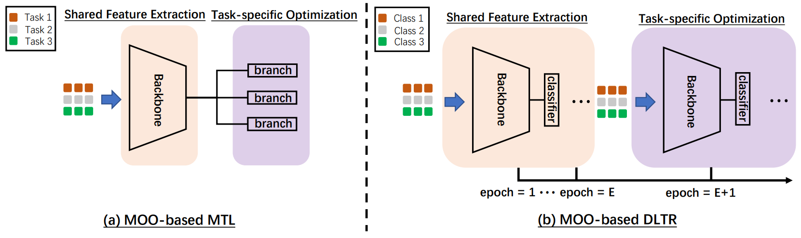

# Pareto Deep Long-Tailed Recognition: A Conflict-Averse Solution
This is the implementation of our ICLR'24 paper "[Pareto Deep Long-Tailed Recognition: A Conflict-Averse Solution](https://openreview.net/pdf?id=b66P1u0k15)". In this paper, we explore the potential of integrating deep long-tailed recognition with multi-objective optimization.
<p align="center">

</p>

## Installation

**Requirements**
* python 3.6
* PyTorch 1.4.0
* torchvision 0.5.0
* opencv 4.2
* numpy 1.19.5

## Training
### CIFAR-10-LT
Specify the data path ("data_root") in configs/Cifar10_100.json. Then running the following commend:
```bash
$ python3 train_cifar.py --config ./configs/Cifar10_100.json
```

### CIFAR-100-LT
Specify the data path ("data_root") in configs/Cifar100_100.json. Then running the following commend:
```bash
$ python3 train_cifar.py --config ./configs/Cifar100_100.json
```

### Stronger Augmentation Usage
Uncomment the CIFAR10Policy and Cutout in datasets/Cifar.py, and change the "mixup" to false in Cifar10_X.json/Cifar100_X.json:
```bash
self.transform = transforms.Compose([
                transforms.RandomCrop(32, padding=4),
                transforms.RandomHorizontalFlip(),
                CIFAR10Policy(),    # add AutoAug
                transforms.ToTensor(),
                Cutout(n_holes=1, length=16),
                transforms.Normalize((0.4914, 0.4822, 0.4465), (0.2023, 0.1994, 0.2010)),
            ])
```

## Citation
```
@inproceedings{zhou2024pareto,
  title={Pareto Deep Long-Tailed Recognition: A Conflict-Averse Solution},
  author={Zhou, Zhipeng and Liu, Liu and Zhao, Peilin and Gong, Wei},
  booktitle={The Twelfth International Conference on Learning Representations},
  year={2024}
}
```

## Correspondence
If you have any further questions, please feel free to contact Zhipeng Zhou by zzp1994@mail.ustc.edu.cn

